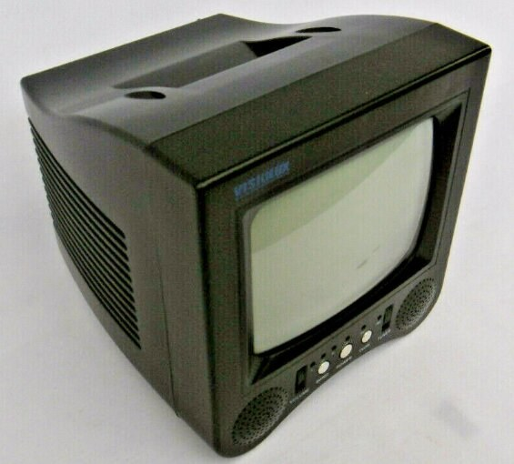
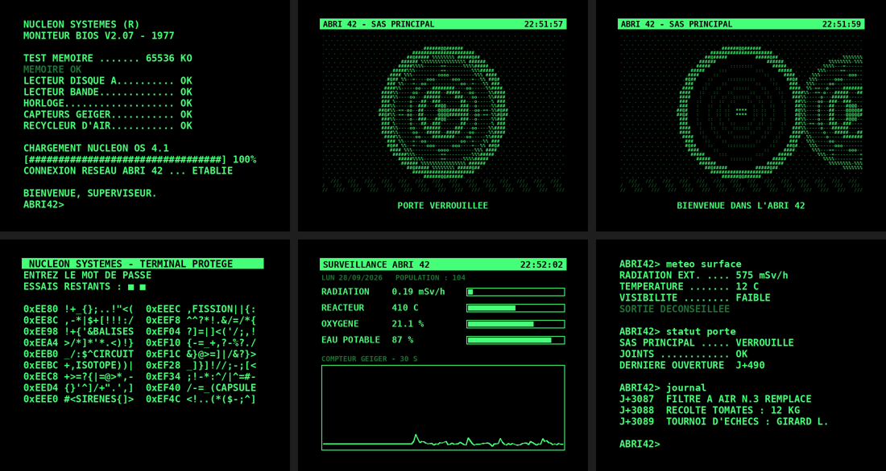

# VisioluxCRT

Des visuels animés façon **terminal rétro-futuriste** sur un petit téléviseur cathodique **Visiolux 5,5"**, pilotés par un **Raspberry Pi** en sortie vidéo composite, avec une **page web** pour tout contrôler depuis un téléphone.

## L'écran

<p align="center">
  
</p>

Le projet est conçu pour ce **mini téléviseur cathodique Visiolux 5,5"**, un petit poste portable à tube. Il dispose d'une entrée antenne et d'une **entrée vidéo composite RCA (jaune)**, que le projet utilise. Tout est calibré pour lui :

- image en 720×576 (PAL, 625 lignes / 50 Hz) ;
- correction du rapport largeur/hauteur des pixels PAL pour que les cercles restent ronds ;
- marges de sécurité pour la partie de l'image rognée par le tube (surbalayage) ;
- texte gras et contrasté, lisible malgré la faible définition du composite.

Le projet fonctionne aussi sur tout autre téléviseur doté d'une entrée composite.

## Aperçu



## Fonctionnalités

**Visuels à l'écran** (720×576, PAL) :

| Visuel | Description |
| --- | --- |
| Démarrage | Séquence de démarrage façon ordinateur des années 70 : test mémoire, périphériques, barre de chargement |
| Porte blindée | Trappe ronde animée en ASCII : le volant tourne, la pression s'égalise, la porte roule et dévoile le tunnel |
| Piratage | Terminal protégé : adresses hexadécimales, mots de passe refusés, puis « ACCES AUTORISE » |
| Moniteur | Tableau de bord de l'abri : radiation, réacteur, oxygène, eau, graphe de compteur Geiger avec alertes |
| Console | Commandes tapées une à une avec leurs réponses (météo de surface, journal, stocks…) |
| Message | Texte envoyé depuis le téléphone, tapé lettre par lettre |
| Image | Photo envoyée depuis le téléphone, convertie en monochrome phosphore |
| Écran noir | Pour reposer le tube |

**Page web** (`http://visiolux.local`) :

- choix du visuel et défilement automatique, de 30 s à 5 min ;
- couleur du phosphore : vert, ambre ou blanc ;
- envoi d'un message ou d'une image, que le Pi recadre et convertit automatiquement ;
- redémarrage et arrêt propre du Raspberry Pi.

L'univers (« NUCLEON SYSTEMES », « ABRI 42 ») est original, inspiré de l'esthétique rétro-futuriste des jeux post-apocalyptiques. Le projet n'est affilié à aucun éditeur.

## Matériel

| Élément | Détail |
| --- | --- |
| Écran | Téléviseur CRT Visiolux 5,5" avec entrée vidéo RCA (jaune) |
| Carte | Raspberry Pi 3B (testé), Zero / Zero 2 W possibles |
| Câble vidéo | Pi 3B : câble jack 3,5 mm 4 contacts vers 3 RCA · Pi Zero : câble RCA soudé sur les pastilles « TV » |
| Réseau | Wi-Fi intégré ou clé USB (testé : TP-Link TL-WN823N v2/v3, puce RTL8192EU, reconnue sans pilote à installer) |
| Alimentation | 5 V 2,5 A |

### Câblage du Pi 3B

Brochage du jack 3,5 mm côté Pi : pointe = audio G, anneau 1 = audio D, anneau 2 = masse, manchon = **vidéo**.

Sur certains câbles de caméscope, la vidéo sort sur la fiche rouge ou blanche plutôt que la jaune : essaie les trois.

## Installation

1. Écris **Raspberry Pi OS Lite** sur la carte SD avec Raspberry Pi Imager. Dans les réglages, renseigne le nom d'hôte `visiolux`, un utilisateur, le Wi-Fi, et active SSH.
2. Connecte-toi en SSH au Pi, puis :

```bash
sudo apt install -y git
git clone https://github.com/alexj0i/VisioluxCRT.git
cd VisioluxCRT
sudo bash install.sh PAL
sudo reboot
```

3. Ouvre `http://visiolux.local` sur un téléphone connecté au même Wi-Fi.

L'argument de `install.sh` choisit la norme vidéo : `PAL` (défaut), `SECAM` ou `NTSC`.

### Ce que fait `install.sh`

- installe les paquets `python3-flask`, `python3-pil`, `python3-numpy` et `fonts-dejavu-core` ;
- copie le programme dans `/opt/visiolux` ; les réglages et l'image envoyée sont stockés dans `/var/lib/visiolux` ;
- active la sortie composite dans `/boot/firmware/config.txt` (`dtoverlay=vc4-kms-v3d,composite`) ;
- ajoute à `/boot/firmware/cmdline.txt` la norme 625 lignes / 50 Hz (`vc4.tv_norm=PAL video=Composite-1:720x576@50ie`) et masque la console ;
- crée et active le service `visiolux.service`.

Les fichiers d'origine sont sauvegardés en `config.txt.bak` et `cmdline.txt.bak`.

> Sur Raspberry Pi OS récent, la sortie composite est en **NTSC par défaut**. Sans `vc4.tv_norm=PAL`, un téléviseur européen affiche une image qui défile ou reste noir.

## Structure

| Fichier | Rôle |
| --- | --- |
| `app.py` | Serveur web Flask et boucle d'affichage (15 images/s) |
| `moteur.py` | Écriture dans le framebuffer (16/32 bpp), terminal texte, rendu ASCII rapide |
| `scenes.py` | Contenu des visuels : textes, scripts, animations |
| `page.html` | Page de contrôle pour mobile |
| `install.sh` | Installation et configuration du Pi |

## Personnaliser

Les textes et animations sont dans `scenes.py`. Les visuels de type terminal sont écrits comme de petits scripts :

```python
def script_demarrage():
    yield ("taper", "NUCLEON SYSTEMES (R)\n", 40)   # texte, caractères/seconde
    yield ("barre", "", 3.5)                        # barre de progression, durée
    yield ("pause", 2)
```

Après une modification :

```bash
sudo systemctl restart visiolux
journalctl -u visiolux -f     # erreurs éventuelles
```

Pour tester sans écran, par exemple sur un PC : `VISIOLUX_APERCU=/tmp/apercu VISIOLUX_PORT=8080 python3 app.py` enregistre une image par seconde dans `/tmp/apercu/apercu.png`.

## Dépannage

| Problème | Solution |
| --- | --- |
| Image qui défile ou écran noir | Vérifie `vc4.tv_norm=PAL` dans `/proc/cmdline` et que `cmdline.txt` tient sur une seule ligne |
| Texte flou | Couleur « blanc » depuis la page web, contraste du téléviseur plus bas, ou essai de `vc4.tv_norm=Mono` (signal sans couleur) |
| `visiolux.local` ne répond plus, le Pi apparaît en `visiolux-2` | Conflit de nom quand l'Ethernet et le Wi-Fi sont branchés en même temps : ajoute `allow-interfaces=wlan0` dans `/etc/avahi/avahi-daemon.conf`, puis `sudo systemctl restart avahi-daemon` |
| Pas de `wlan0` sur un Pi 3B | Puce Wi-Fi défectueuse (`mmc1: Failed to initialize` dans `dmesg`) : utiliser une clé Wi-Fi USB |
